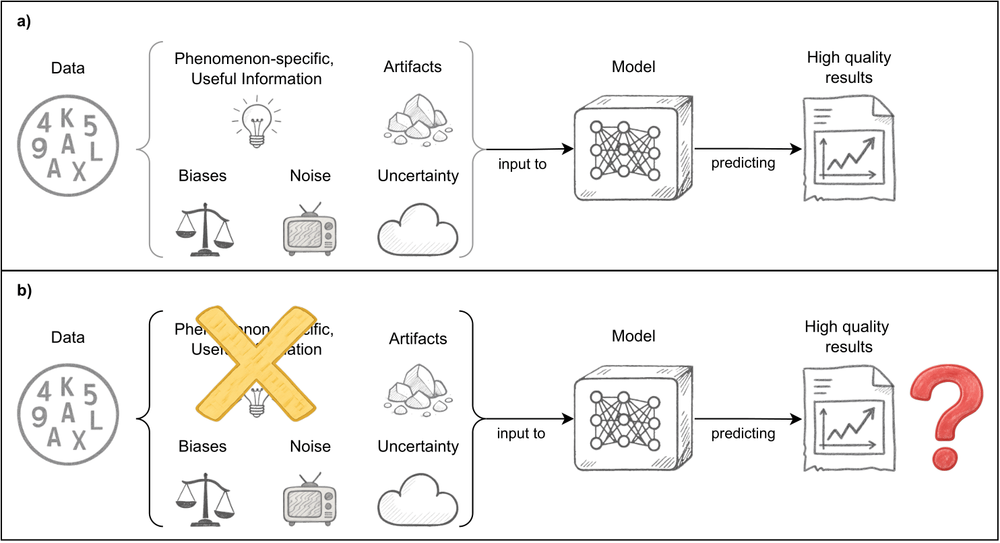

# Data-related Ablation for Reinforcing Deep Learning in Explaining Complex Phenomena

Currently under review for the *International Journal of Neural Systems*.

## Abstract

*"Deep Learning (DL) models excel at automatically learning intricate patterns within complex data, but
their black box nature undermines human trust. To address this, current validation strategies typically
focus on the model itself, modifying its architecture to assess the role and importance of the components.
However, this model-centric view overlooks the critical learning substrate, which is represented by the
data, implicitly assuming that it accurately represents the target phenomenon. This implicit trust in
data means that evaluation may fail to detect whether high performance stems from exploiting biases
or data quirks rather than learning relevant patterns. We present a novel data-related ablation as a
complement to the traditional model-related ablation. Using this framework for electroencephalogra-
phy (EEG) signals of emotional recognition (ER) and motor execution (ME), we show that seemingly
high-accuracy models often rely heavily on process-irrelevant features, maintaining performance even
when key information is eliminated. This shows that a standard, data-independent evaluation can be
misleading about whether a model truly captured the intended process; the proposed approach helps
distinguish robust learning from leaning on incidental characteristics. Therefore, incorporating data-
related ablation is essential for developing reliable and generalizable DL models in fields that rely on
data derived from complex and often not completely known processes."*



## Pre-requisites

These instructions works for Ubuntu from the current directory. If you have another OS, the steps are similar.

- [Install Anaconda](https://www.anaconda.com/docs/getting-started/anaconda/install)
- Create a new `conda` environment:

    ```bash
    conda create --name data_related_ablation
    ```
- Activate the new environment:

    ```bash
    conda activate data_related_ablation
    ```
- Install the pre-requisites:

    ```bash
    pip install -r requirements.txt
    ```

- Put the DEAP and High Gamma datasets, unpacked, into a folder located at `../../datasets`. Specifically:
    - Put DEAP in `../../datasets/deap`
    - Put High Gamma`../../datasets/hg`

## Run tests

- Generate the `.yaml` configuration files with default hyperparameters into the `configs` folder:

    ```bash
    python generate_configs.py configs
    ```
    This will populate the configs folder with `.yaml` files containing default hyperparameters for all experiments.

- Run a test of your chosen configuration file (for example `deap_kfold_eeg_dino.yaml`):

    ```bash
    python main.py configs/deap_kfold_eeg_dino.yaml
    ```

## Notes

- All paths are relative to the repository root.
- Ensure that the datasets are unpacked and accessible at the specified paths.
- The repository is tested with Python 3.11, PyTorch 2.6, and Ubuntu 22.04

## Support

For any question, send an email to Romeo Lanzino at `lanzino@di.uniroma1.it`.